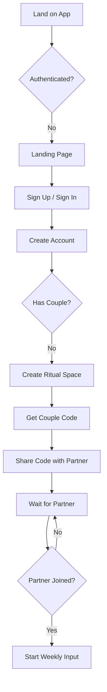
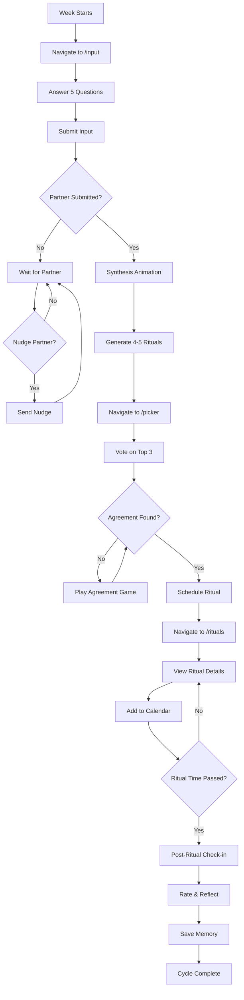
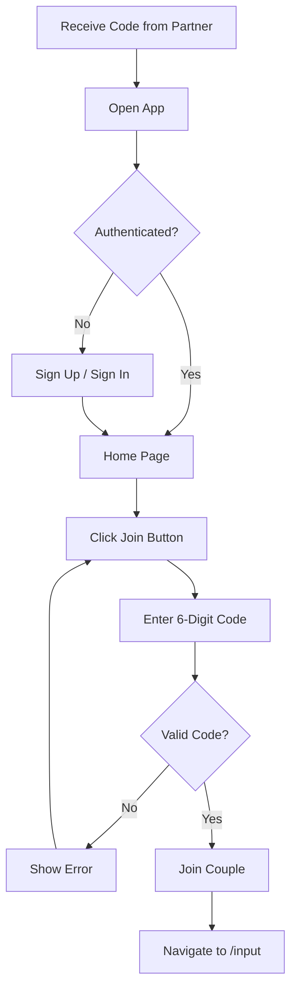

# User Flows Documentation

## Core User Journey

### Flow 1: New User Onboarding



### Flow 2: Weekly Ritual Cycle



### Flow 3: Partner Joining with Code



## Detailed State Machine

### Application State Model

```
USER_STATE:
  - unauthenticated
  - authenticated_no_couple
  - authenticated_solo_couple (waiting for partner)
  - authenticated_active_couple

CYCLE_STATE:
  - no_cycle
  - awaiting_user_input
  - awaiting_partner_input
  - awaiting_synthesis
  - awaiting_agreement
  - ritual_scheduled
  - ritual_passed
  - feedback_complete

NAVIGATION_LOGIC:
  IF user = unauthenticated:
    → /auth or /landing
  
  IF user = authenticated_no_couple:
    → /home (show create/join options)
  
  IF user = authenticated_solo_couple:
    → /home (show couple code)
  
  IF couple_complete AND cycle = no_cycle:
    → /input
  
  IF cycle = awaiting_user_input:
    → /input
  
  IF cycle = awaiting_partner_input:
    → /home (waiting component)
  
  IF cycle = awaiting_synthesis:
    → /home (synthesis animation)
  
  IF cycle = awaiting_agreement:
    → /picker
  
  IF cycle = ritual_scheduled AND NOT ritual_passed:
    → /rituals
  
  IF cycle = ritual_passed AND NOT feedback_complete:
    → /home (post-checkin prompt)
```

## User Actions & System Responses

### 1. Submit Weekly Input

**User Action:**
1. Navigate to /input
2. Answer 5 questions via magnetic canvas
3. Click Submit

**System Response:**
1. Save input to weekly_cycle (partner_one_input or partner_two_input)
2. Set submitted_at timestamp
3. Check if partner has submitted
4. If yes, trigger synthesis
5. If no, navigate to /home (waiting state)
6. Partner receives realtime update

**Edge Cases:**
- Network error: Show error toast, don't clear form
- Partner submitted while user filling out: Show synthesis animation immediately
- User tries to resubmit: Not allowed (need "Start New Week" action)

### 2. Vote on Rituals

**User Action:**
1. Navigate to /picker
2. Swipe through carousel
3. Select top 3 choices
4. Assign ranks (1, 2, 3)
5. Submit preferences

**System Response:**
1. Save to ritual_preferences table
2. Check if partner has voted
3. If yes, find agreement
4. If agreement found, navigate to /rituals
5. If not, navigate to /picker (agreement game)
6. Partner receives realtime update

**Agreement Logic:**
```typescript
// Find rituals that appear in both partners' top 3
const sharedRituals = partnerOneTop3.filter(r => 
  partnerTwoTop3.some(p => p.title === r.title)
);

if (sharedRituals.length > 0) {
  // Pick highest combined rank
  const best = sharedRituals.sort((a, b) => {
    const aScore = getPartnerOneRank(a) + getPartnerTwoRank(a);
    const bScore = getPartnerOneRank(b) + getPartnerTwoRank(b);
    return aScore - bScore;
  })[0];
  
  return best;
} else {
  // No overlap → Agreement Game
  return null;
}
```

### 3. Agreement Game

**User Action:**
1. Presented with partner's top 3 choices
2. Click "Pick One" on a card
3. Confirm selection

**System Response:**
1. Set agreed_ritual
2. Set agreement_reached = true
3. Navigate to /rituals
4. Partner receives realtime update

### 4. Schedule Ritual

**User Action:**
1. View ritual on /rituals
2. Select date
3. Select time
4. Confirm

**System Response:**
1. Update weekly_cycle.agreed_date
2. Update weekly_cycle.agreed_time
3. Show ICS download option
4. Partner receives realtime update

### 5. Complete Ritual

**User Action:**
1. Ritual time passes
2. Navigate to /home
3. See post-ritual check-in prompt
4. Click "Share Your Experience"
5. Fill out feedback form:
   - Did you complete it?
   - Connection rating (1-5)
   - Would repeat?
   - Notes
6. Submit

**System Response:**
1. Save to ritual_feedback table
2. If completed = yes, create completion record
3. Update ritual_streaks
4. Save to ritual_memories
5. Close post-checkin modal
6. Mark cycle as complete

### 6. Nudge Partner

**User Action:**
1. See "Nudge Partner" button on /home (waiting state)
2. Click button

**System Response:**
1. Call nudge-partner edge function
2. Update weekly_cycle.nudged_at
3. Partner sees nudge banner on next load
4. Rate limit: Once per hour

## Accessibility Considerations

- **Keyboard Navigation:** All interactive elements keyboard accessible
- **Screen Readers:** Semantic HTML with ARIA labels
- **Focus Management:** Focus trapped in modals
- **Color Contrast:** WCAG AA compliant (TODO: audit)
- **Touch Targets:** Minimum 44x44px
- **Error Messages:** Clearly announced

## Mobile-Specific Flows

### iOS Safari Considerations
- **Install Prompt:** Add to Home Screen banner
- **Safe Areas:** pb-safe class for bottom nav
- **Viewport Lock:** StrictMobileViewport component

### Android Chrome Considerations
- **PWA Manifest:** (TODO: Add manifest.json)
- **Install Banner:** (TODO: Implement)

## Error Recovery Flows

### Network Error During Submission
```
User submits → Network fails → Show error toast
              ↓
              Data preserved in form
              ↓
              User clicks "Try Again"
              ↓
              Resubmit with saved data
```

### Stale Data After Realtime Miss
```
Partner submits → Realtime update missed → User sees old state
                ↓
                User navigates → useEffect refresh fires
                ↓
                Fetch fresh data → Update context
                ↓
                Navigate to correct route
```

### Week Boundary Bug (Fixed)
```
Cycle created on Nov 30 → Week changes to Dec 2 → Old logic looked for Dec 2 cycle
                        ↓
                        No cycle found → null state → "Ready for This Week?" shown
                        
FIXED: Now looks for most recent incomplete cycle first, then current week
```

## Future Flow Improvements

1. **Onboarding Tutorial:** First-time user walkthrough
2. **Ritual Suggestions:** Proactive AI suggestions based on history
3. **Habit Tracking:** Streak visualization and motivation
4. **Photo Memories:** Upload photos with feedback
5. **Calendar Integration:** Native calendar sync beyond ICS
6. **Push Notifications:** Reminders and partner updates
7. **Ritual Templates:** Save custom ritual formats
